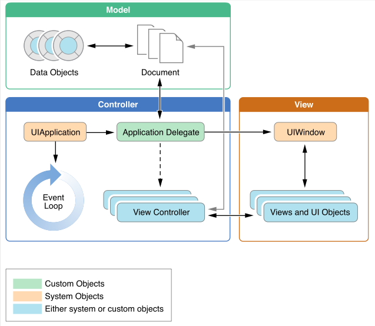

<!-- .slide: class="titulo" -->
## Tecnologías de Desarrollo de Aplicaciones. Bloque iOS
## Introducción a las aplicaciones iOS

---

## Puntos a tratar

- **MVC en iOS**
- Estructura del código de una aplicación

---

## Modelo/Vista/Controlador

Patrón de diseño arquitectónico que separa el **modelo del dominio** de su **representación en la interfaz**

 <!-- .element class="stretch" -->

---

## Algunas variantes

[http://kasparov.skife.org/blog/src/java/mvc.html](http://kasparov.skife.org/blog/src/java/mvc.html) <!-- .element class="fig_caption" -->

---

## Modelo/Vista/Controlador en iOS

 <!-- .element: class="stretch" -->

---

## El modelo

  - El núcleo de la aplicación, los objetos que modelan la **lógica de negocio**
  - Son clases creadas por nosotros, no heredan de ninguna librería de iOS
  - No debería contener referencias al controlador ni a la vista. Esto permite que sea **reutilizable** aunque cambie la interfaz de la aplicación
  - Comunica con el controlador con *notificaciones* o *KVO* (eventos)
  

---

## La vista

- Normalmente se crea de manera gráfica, con el `interface builder` de Xcode
- Usa clases del sistema: `Button`, `Label`,... (o heredan de estas para personalización)

---

## El controlador

- El "pegamento" entre vista y modelo
- Contiene referencias a vista y modelo (variables miembro)
    * Las referencias al modelo nos permiten consultar su estado o llamar a métodos "de negocio" (ej. en una agenda `getCitas(dia:)` o `borrarTarea(id:)`)
    * Las referencias a la vista nos permiten cambiar y consultar su estado (ej. consultar/cambiar el texto de un `Label`)

---

Es muy tentador colocar los métodos "de negocio" en el controlador en lugar de en clases aparte, ya que para *apps* pequeñas parece mucho más simple

---

---

## Puntos a tratar

- MVC en iOS
- **Estructura del código de una aplicación**

---

## Estructura del código de una app

 
<!-- .element: class="stretch" -->

---

## El ciclo de MVC

1. El usuario interactúa con la interfaz (p.ej. pulsa un botón)
2. iOS nos avisa del evento llamando a un método del controlador (un *action*)
3. Llamamos al modelo para obtener un resultado
4. Mostramos el resultado modificando algún componente de la vista que tenemos referenciado en nuestro controlador (*outlet*)

---

# ¿Alguna pregunta?

