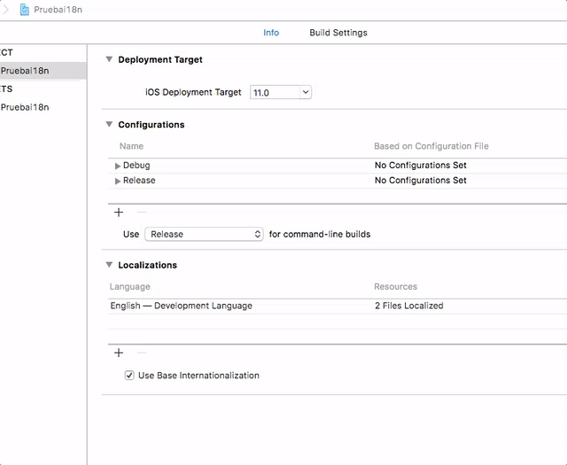

<!-- .slide: class="titulo" -->

## Tecnologías de Desarrollo de Aplicaciones
## Internacionalización de *apps* iOS


---

## Internacionalización y localización

* Debemos adaptar la *app* al idioma/país del usuario
    - Traducir mensajes al usuario
    - Adaptar unidades de medida, formatos de números, fechas, etc.
* Internacionalización (i18n): preparación de la *app* para poder usar distintos idiomas
* Localización: adaptación de la *app* a un idioma determinado

---

## Contenidos

1. Preparar la *app* para internacionalización
2. Adaptar la interfaz de usuario
3. Adaptar el código

---

**Idioma base**: el usado para desarrollar la *app*. Por defecto es el inglés. Para cambiarlo habría que [editar manualmente el archivo `.pbxproj`](https://www.ralfebert.de/snippets/ios/xcode-change-development-language/)

**Añadir idiomas**: en las propiedades del proyecto

<div class="stretch">

</div>

---


**CUIDADO**: para empezar, se recomienda añadir los idiomas una vez hayamos terminado de desarrollar la interfaz en el idioma base, luego veremos por qué


---


TRASPAS no continúan de momento porque en lugar de usarlas vamos a hacer una demo en clase

---

## i18n para los textos insertados en el código

Hay mensajes que no están  en la interfaz, sino que se generan desde el código. Por ejemplo recordemos la app UAdivino.

```swift
import Foundation

class Adivino {
    func obtenerRespuesta() -> String {
        let respuestas = ["Si", "No", "Ni de casualidad", "¡Por supuesto!"]
        let indice = Int(arc4random_uniform(UInt32(respuestas.count)))
        return respuestas[indice]
    }
}
```

¿Cómo los internacionalizamos?

---

## Localized Strings


Cadenas que en el código no se toman de manera literal sino que se consideran claves en un archivo `.Strings`

```swift
import Foundation

class Adivino {
    func obtenerRespuesta() -> String {
        let respuestas = ["si", "no", "ni_casualidad", "claro"]
        let indice = Int(arc4random_uniform(UInt32(respuestas.count)))
        return respuestas[indice]
    }
}

```

---

Para generar el mensaje real que verá el usuario se usa `NSLocalizedString`:

```swift
@IBAction func botonPulsado(_ sender: AnyObject) {
    let respuesta = self.miAdivino.obtenerRespuesta()
    self.labelRespuesta.text = NSLocalizedString(respuesta, comment: "")
}
```

*(El segundo parámetro de NSLocalizedString es un comentario que pueda ayudar a un traductor de la app a entender el contexto del mensaje)*

---


Faltaría crear el archivo `.strings`, que por defecto se debe llamar `Localizable.strings` (detalles en los apuntes).

En realidad es un fichero físico distinto por cada idioma:

```json
"si" = "Yes!";
"no" = "No!";
"ni_casualidad" = "No way!";
"claro" = "Sure!";```
```

```json
"si" = "¡Si!";
"no" = "¡No!";
"ni_casualidad" = "¡Ni de casualidad!";
"claro" = "¡Claro que sí!";
```


---


# ¿Alguna pregunta?